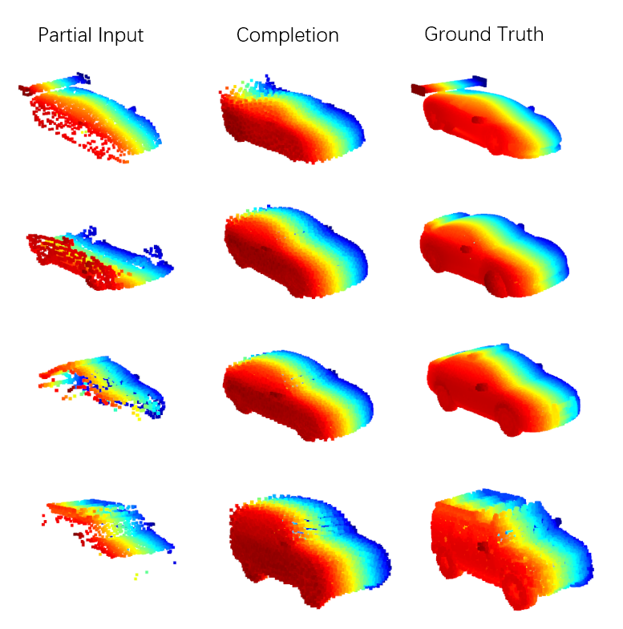

# PCN: Point Completion Network

This is implementation of PCN——Point Completion Network in pytorch. PCN is an autoencoder for point cloud completion. As for the details of the paper, please refer to [arXiv](https://arxiv.org/pdf/1808.00671.pdf).

## Environment

* Python 3.7.9
* PyTorch 1.7.0
* CUDA 10.1.243

## Reconstruction

I just use the category of car to train, evaluation and test the model. All of the data is created by myself. By running the evaluation script `evaluation.py`, we can get a average cd loss `0.0097` on the test split.

## Examples

