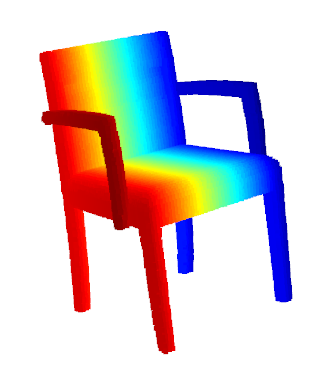
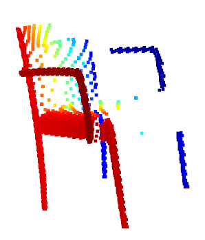
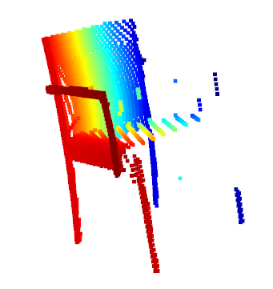
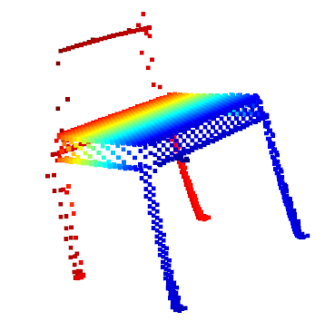
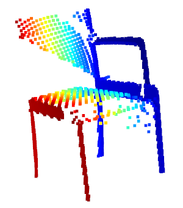
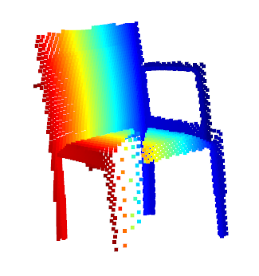
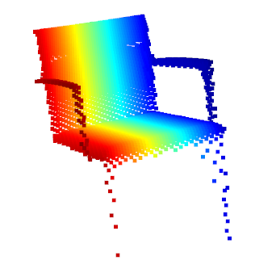
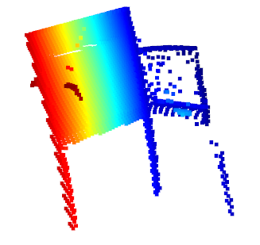
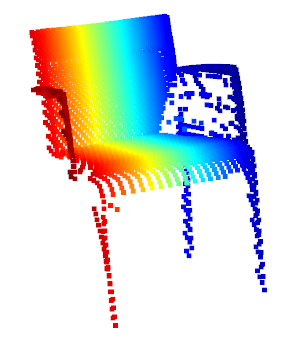

# render

## Description

`process_exr.py` and `render_depth.py` are used for generating the partial point cloud from CAD model.

In order to run the `render_depth.py`, you need to install [Blender](https://www.blender.org/) firstly. After complete installing, you can use this command to render the depth images:

```bash
blender -b -P render_depth.py [ShapeNet directory] [model list] [output directory] [num scans per model]
```

The images will be stored in OpenEXR format. The version of blender I used is `2.9.1`.

In order to run the `process_exr.py`, you need to install `imath`、`OpenEXR` and `open3d-python`. These are third python modules, you can install with `pip`. The command to generate partial point clouds from `.exr` is:

```bash
python3 process_exr.py [model list] [intrinsics file] [output directory] [num scans per model]
```

The version of Python should not be too high. I use the version of `3.7.9`.

## Example

Complete point cloud:



Partial point clouds:









